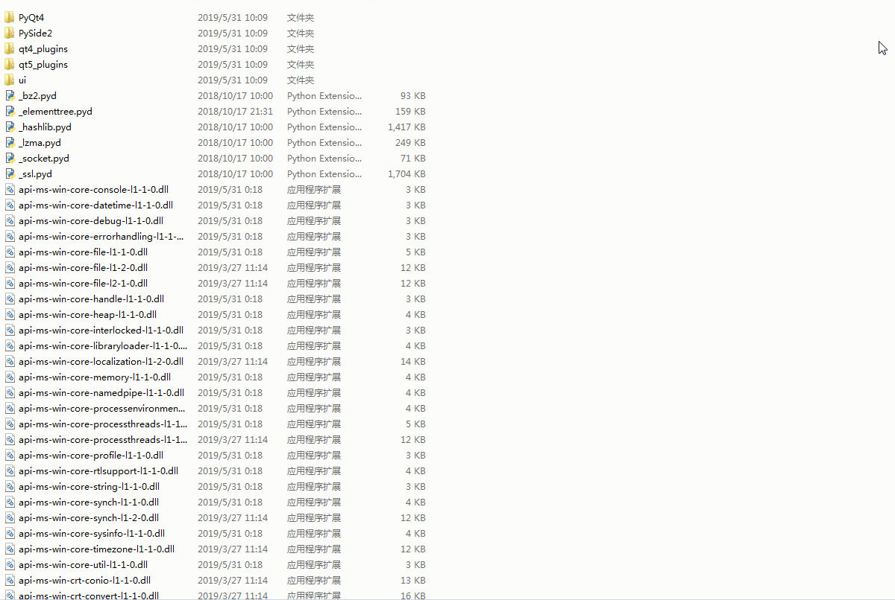

# PoemMaster
Using PySide2 make a simple poem game

---

> &emsp;&emsp;2019年3、4月的时候做安卓开发的时候做了一个古诗词Demo  
> &emsp;&emsp;不过最后没有用上，有些遗憾。所以效果实现也比较简单。  
> &emsp;&emsp;既然代码都有了，只是将 Java 转换成 Python ，我觉得难度应该不大。  
> &emsp;&emsp;所以就有了用 Python Qt 来重建这个 APP 上实现的功能。  

> &emsp;&emsp;下面就是重写实现的效果。   
> &emsp;&emsp;源码在 souce 文件夹中。   

---

关于该开发的分析详见 [博客文章](https://fxtd-odyssey.github.io/posts/712b664b.html)